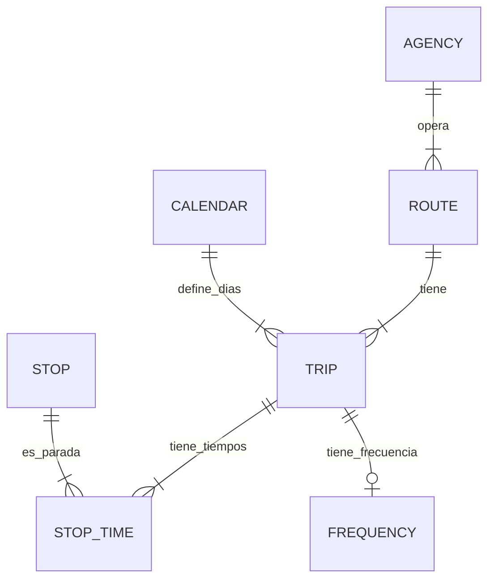

# Análisis de Datos GTFS - Metro CDMX

Este documento detalla la estructura y relaciones de los archivos GTFS ubicados en `Datos/Crudo/f-9g3-semovi-latest`, con el objetivo de implementar una función para obtener el "próximo tren".

## 1. Archivos Analizados

| Archivo | Descripción | Clave Principal |
| :--- | :--- | :--- |
| `agency.txt` | Agencias de transporte (Metro, Metrobús, etc.). | `agency_id` |
| `calendar.txt` | Calendario de servicios (días de operación). | `service_id` |
| `frequencies.txt` | Frecuencia de viajes para rutas sin horario fijo. | `trip_id` |
| `routes.txt` | Definición de rutas (Líneas). | `route_id` |
| `stop_times.txt` | Horarios de paso por estación (tiempos exactos o relativos). | `trip_id`, `stop_id` |
| `stops.txt` | Estaciones y paradas (ubicación geográfica). | `stop_id` |
| `trips.txt` | Viajes específicos asociados a rutas y servicios. | `trip_id` |

## 2. Relaciones entre Archivos

Para conectar una **Estación** con un **Horario**, se sigue el siguiente flujo:



1.  **`stops.txt`** define el `stop_id` (Estación).
2.  **`stop_times.txt`** vincula `stop_id` con `trip_id` y asigna una hora (`arrival_time`).
3.  **`trips.txt`** vincula `trip_id` con `route_id` (Línea) y `service_id` (Calendario).
4.  **`calendar.txt`** indica qué días de la semana opera un `service_id`.
5.  **`frequencies.txt`** (Opcional) indica si un `trip_id` se repite con una frecuencia constante entre un rango de horas.

## 3. Implementación de "Próximo Tren"

Para implementar la función `get_next_train(station_id, current_time)`, se debe considerar dos tipos de operación: **Horario Fijo** y **Frecuencia**.

### Algoritmo Propuesto

1.  **Identificar Viajes en la Estación**:
    *   Filtrar `stop_times.txt` donde `stop_id` coincida con la estación solicitada.
    *   Obtener la lista de `trip_id` y sus respectivos `arrival_time`.

2.  **Filtrar por Día de la Semana**:
    *   Para cada `trip_id`, buscar su `service_id` en `trips.txt`.
    *   Verificar en `calendar.txt` si ese `service_id` está activo el día de hoy (ej. `monday=1`).
    *   *Nota*: Verificar fechas de vigencia (`start_date`, `end_date`).

3.  **Calcular Hora de Llegada**:
    *   **Caso A: Horario Fijo** (El `trip_id` NO está en `frequencies.txt`):
        *   El `arrival_time` en `stop_times.txt` es la hora absoluta (ej. `14:30:00`).
        *   Si `arrival_time` > `current_time`, es un candidato.
    *   **Caso B: Frecuencia** (El `trip_id` ESTÁ en `frequencies.txt`):
        *   En `frequencies.txt`, obtener `start_time`, `end_time`, y `headway_secs`.
        *   En `stop_times.txt`, el `arrival_time` es relativo al inicio del viaje (ej. `00:10:00`).
        *   El primer tren pasa a `frequencies.start_time` + `stop_times.arrival_time`.
        *   Los siguientes trenes pasan cada `headway_secs`.
        *   Calcular: `Hora Tren = (Start Time + Relative Time) + (N * Headway)`.
        *   Encontrar el menor `N` tal que `Hora Tren` > `current_time` y `(Start Time + N * Headway)` < `end_time`.

4.  **Seleccionar el Más Próximo**:
    *   De todos los candidatos válidos (Fijos y Frecuencia), seleccionar el que tenga la menor diferencia con `current_time`.

### Ejemplo de Datos

**Frecuencia (`frequencies.txt`)**:
```csv
trip_id, start_time, end_time, headway_secs
055115O000_1, 05:15:00, 18:30:00, 1800 (30 min)
```

**Tiempos Relativos (`stop_times.txt`)**:
```csv
trip_id, stop_id, arrival_time
055115O000_1, ESTACION_X, 00:10:00
```

**Cálculo**:
*   Primer tren en ESTACION_X: `05:15:00` + `00:10:00` = `05:25:00`.
*   Siguiente tren: `05:25:00` + 30 min = `05:55:00`.
*   Y así sucesivamente hasta las `18:30:00`.

## 4. Notas Adicionales
*   **Formato de Hora**: GTFS permite horas mayores a 24:00:00 (ej. `25:00:00` es la 1:00 AM del día siguiente). La función debe manejar esto normalizando las horas.
*   **Timezone**: `agency.txt` define `America/Mexico_City`.
